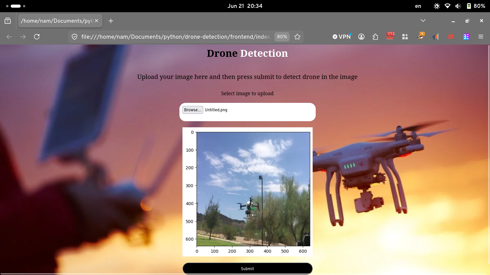
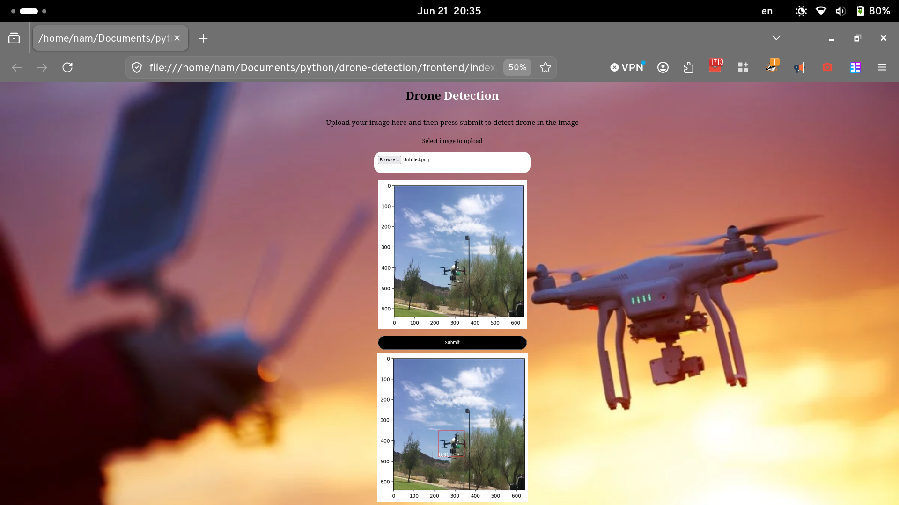

# 🛸 Drone Detection Web Application

> An asynchronous full-stack web application that detects drones in uploaded images using a fine-tuned YOLOv8 model, displays real-time SVG bounding box overlays, and logs prediction history in an SQLite database.

## 📷 Preview

| 1. Upload & Preview | 2. Detection Result (SVG Overlay) |
| :---: | :---: |
|  |  |
---

## 🚀 Features

* **AI-Powered Detection:** Leverages Ultralytics YOLOv8 object detection framework via OpenCV.
* **Asynchronous Backend:** Powered by FastAPI for high-performance, non-blocking I/O operations.
* **Async Database Logging:** Uses `aiosqlite` to track user sessions and log prediction data (bounding boxes, confidences, and file paths).
* **Dynamic UI Overlay:** The JavaScript frontend translates prediction coordinates directly into an absolutely positioned SVG overlay drawn cleanly over the source image.
* **Robust Validation:** Safeguards against empty file submissions and strict file size limits ($< \text{10 MB}$).
* **Automated Testing:** Test suite covering endpoints, database connectivity, and edge-case exceptions using `pytest`.

---

## 📁 Project Structure

```text
.
├── app/
│   ├── aimodel.py        # YOLOv8 configuration and prediction engine
│   ├── database.py       # Async SQLite schema setup and prediction logging
│   └── main.py           # FastAPI server routing, CORS, and SVG generator
├── examples/             # Sample images for testing or showcasing
│   ├── cars-city-traffic-daylight_23-2149092081.avif
│   └── Untitled.png
├── frontend/             # Frontend client assets
│   ├── asset/
│   │   └── Drones 1600x800.webp
│   ├── css/
│   │   └── style.css
│   ├── index.html
│   └── scripts/
│       └── index.js
├── models/               # Model weights storage
│   ├── best.pt           # Custom fine-tuned weights
│   └── yolov8m.pt        # Default YOLOv8 medium weights
├── notebooks/            # Jupyter notebooks used during EDA/Training
│   └── notebook094b2d999a.ipynb
├── tests/                # Automated test cases
│   ├── test_database.py
│   └── test_main.py
├── output_img/           # (Optional) Saved model prediction visual exports
├── upload_images/        # Auto-created folder for uploaded source images
├── Yolo/                 # YOLO pipeline configuration or training references
├── .env                  # Configuration environment variables
└── requirements.txt      # Python package dependencies

```

---

## 🛠️ Setup and Installation

### 1. Prerequisites

Ensure you have **Python 3.8+** installed on your machine.

### 2. Environment Configuration

Open your terminal in the project root directory and create a virtual environment:

```bash
# Create virtual environment
python3 -m venv venv

# Activate virtual environment
# On Linux/macOS:
source venv/bin/activate
# On Windows:
.\venv\Scripts\activate

```

### 3. Install Dependencies

Install all required third-party libraries:

```bash
pip install -r requirements.txt

```

### 4. Setup Environment Variables (`.env`)

Create a `.env` file in the root directory to customize your local defaults:

```ini
model_path="models/best.pt"
database_path="app/database.db"
save_output=False
confidence=0.5
image_size=640

```

---

## 🖥️ Running the Application

### Start the Backend Server

Fire up the FastAPI application using Uvicorn:

```bash
uvicorn app.main:app --port 8080 --reload

```

Upon startup, the server will automatically verify/create your SQLite database structure inside `app/database.db`, load the configured YOLO model, and serve on `http://127.0.0.1:8080`.

### Launch the Frontend

Because the backend includes full CORS access (`allow_origins=["*"]`), you can simply open the `frontend/index.html` file directly in any modern web browser to interact with the system.

1. **Select an image** to instantly see a preview.
2. Click **Submit** to process the image through the YOLO backend.
3. Watch the SVG overlay generate automatically over the target drone!

---

## 🧪 Running Tests

The test suite includes validation tests for server responses, bounding boxes formatting, empty uploads, and file-size exception blocks.

Run your test files using `pytest`:

```bash
pytest

```

---

## 🔌 API Endpoints Reference

| Endpoint | Method | Response Type | Description |
| --- | --- | --- | --- |
| `/` | `GET` | `application/json` | Base health indicator greeting. |
| `/checkhealth` | `GET` | `text/html` | Standard status ping (`The server is healthy`). |
| `/predict` | `POST` | `text/html` | Receives multipart form image data, runs object detection, logs metadata to SQLite, and returns custom SVG elements containing coordinates and confidence rates. |
